## 项目

| 项目 | 研究方向 | 已实现内容 |
|---|---|---|
| [hypofuse](https://github.com/hawaiicoco/hypofuse) | 语音识别后处理 | n-best 清单校验、ROVER 融合与混淆网络、n-gram 重打分与浅融合、置信度校准、CER/WER 切片错误分析 |
| [slotvox](https://github.com/hawaiicoco/slotvox) | 端到端语音理解 | 合成任务型对话工厂、联合意图-槽位模型、流式部分意图、语音 LLM 指令数据管线、回合级评测与报告 |

两个项目都包含命令行工具、可运行示例、契约/黄金测试和 CPU 模型测试，全部离线可复现。

## 技术栈

## 活动

<picture>
  <source media="(prefers-color-scheme: dark)" srcset="https://raw.githubusercontent.com/hawaiicoco/hawaiicoco/output/github-snake-dark.svg" />
  <source media="(prefers-color-scheme: light)" srcset="https://raw.githubusercontent.com/hawaiicoco/hawaiicoco/output/github-snake.svg" />
  
</picture>

## 当前关注

- 多假设对齐与融合策略的确定性评测，校准曲线的诚实解读。
- 语音-文本统一 token 序列上的联合建模、流式解码与背压语义。
- 合成数据上的可复现训练链路：种子、锁文件与逐提交检查。
